# options

### Unofficial Python3 version of "[A Laplacian Framework for Option Discovery in Reinforcement Learning](http://proceedings.mlr.press/v70/machado17a/machado17a.pdf)" paper.
----

##### Images from the paper:

*Second PVF (left) and its corresponding option (right) in the 4-room domain. Action terminate is depicted in red (top right corner), other actions are depicted as arrows.*

*Options obtained from the four smallest eigenvectors in the 4-room domain. Action terminate is depicted in red.*

##### Images obtained by running the official Python2 code:

             |   |  | 
:-------------------------:|:-------------------------:|:-------:|:------:|

*Options obtained from the four smallest eigenvectors in the 4-room domain. Action terminate is depicted using dots.*
  

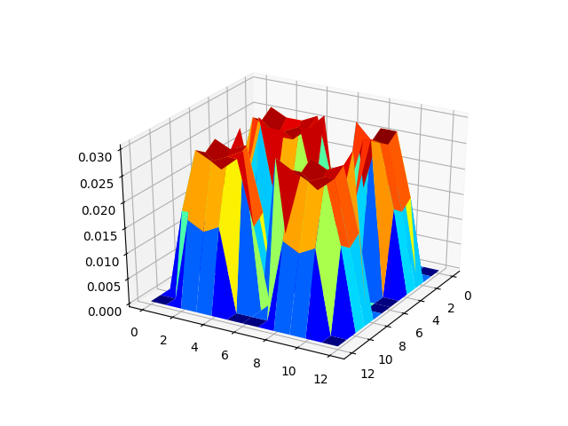 |  | 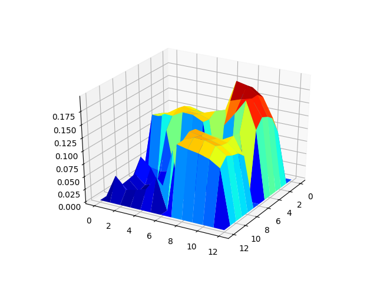 | 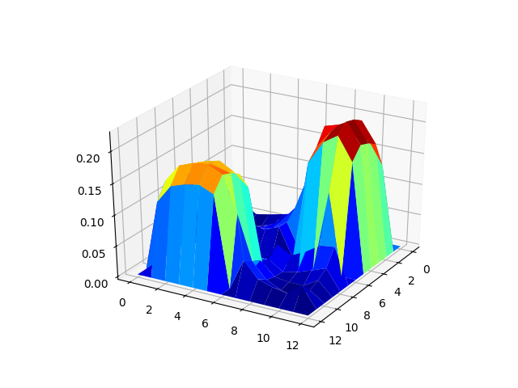
:-------------------------:|:-------------------------:|:-------:|:------:|

*Value functions in 4-room domain.*

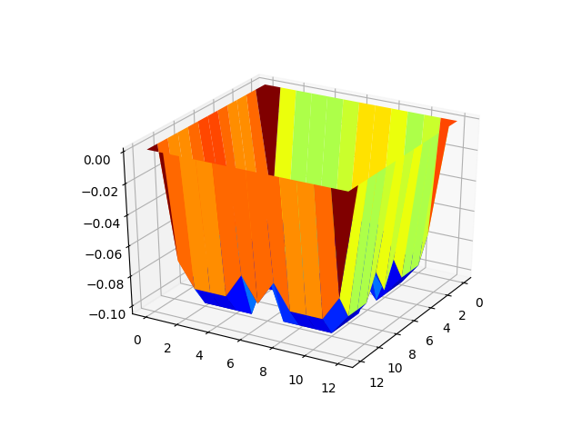 | 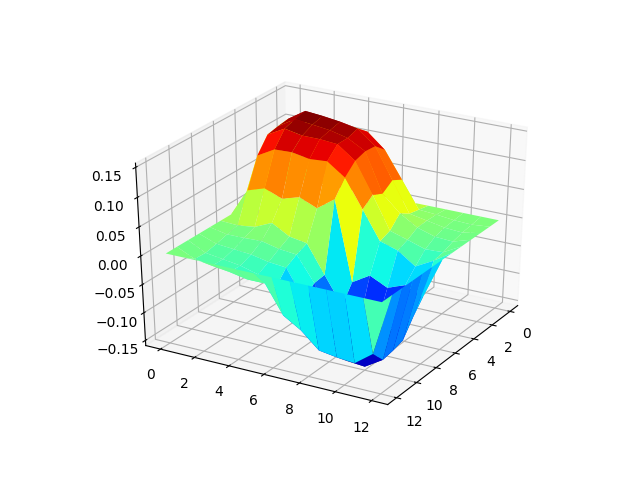 | 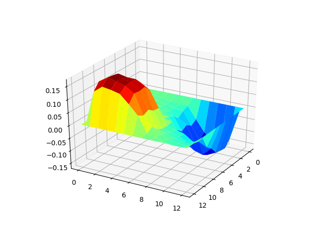 | 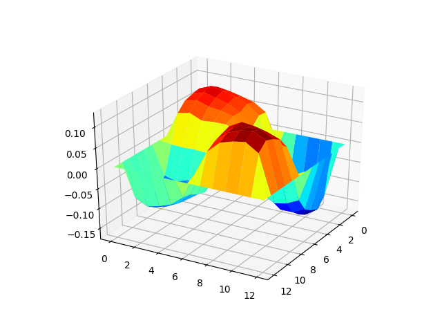
:-------------------------:|:-------------------------:|:-------:|:------:|

*PVFs in 4-roon domain.*

##### Images obtained by running the converted Python3 code:

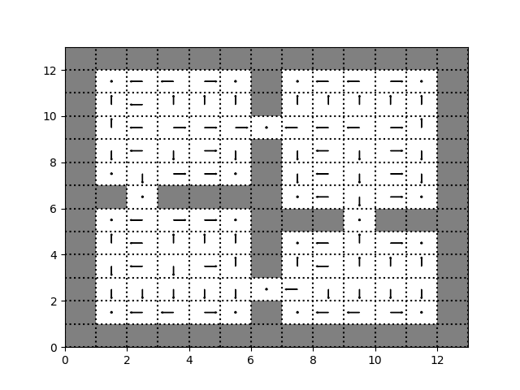 |  | 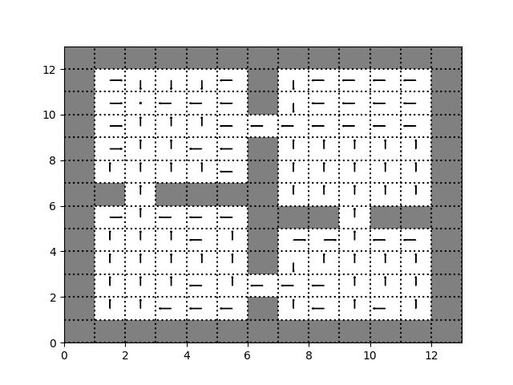 | 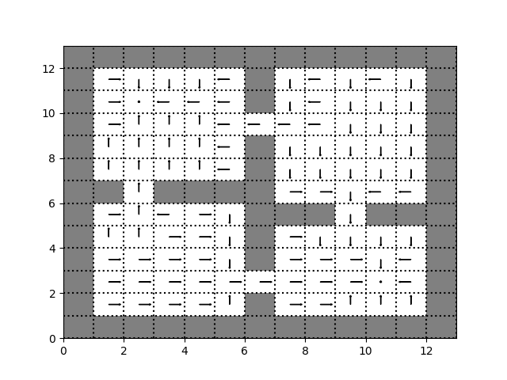
:-------------------------:|:-------------------------:|:-------:|:------:|

*Options obtained from the four smallest eigenvectors in the 4-room domain. Action terminate is depicted using dots.*
  

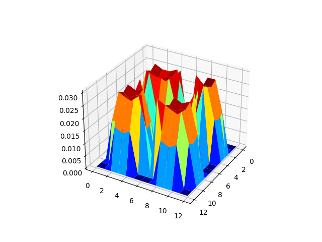 | 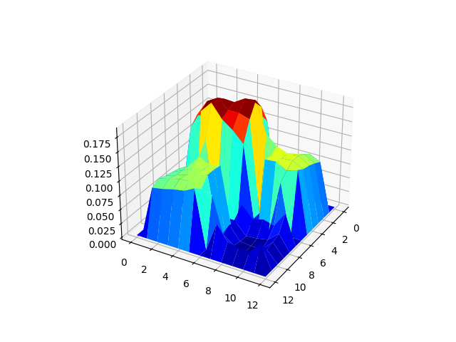 | 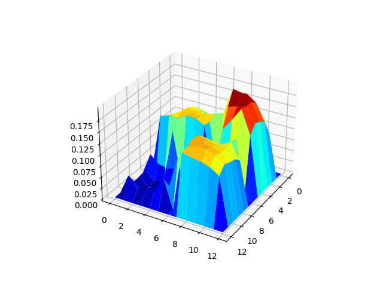 | 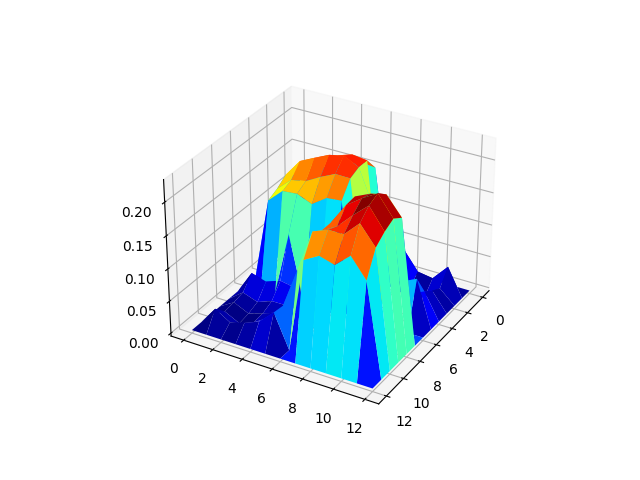
:-------------------------:|:-------------------------:|:-------:|:------:|

*Value functions in 4-room domain.*

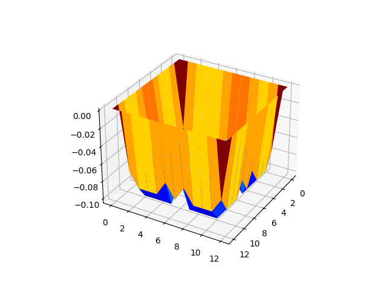 | 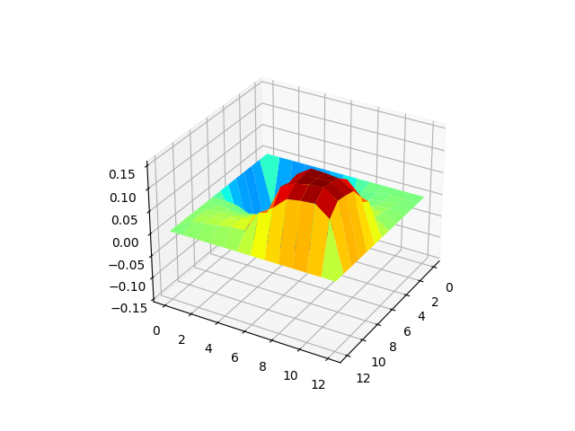 | 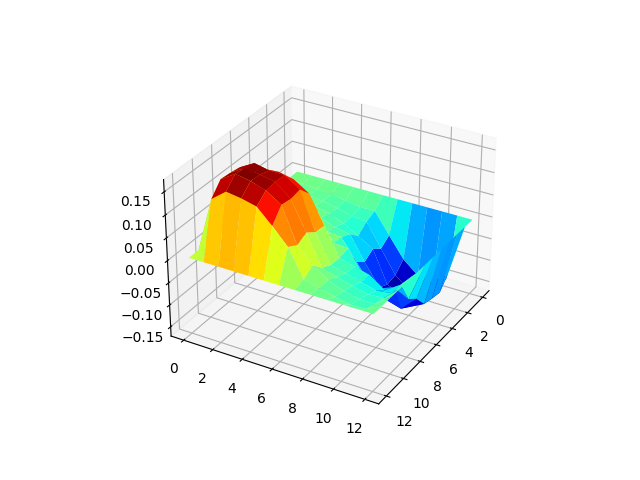 | 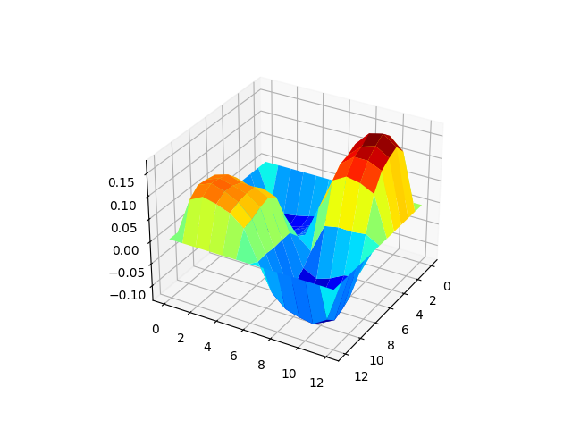
:-------------------------:|:-------------------------:|:-------:|:------:|

*PVFs in 4-roon domain.*

*Q-Learning using options.*