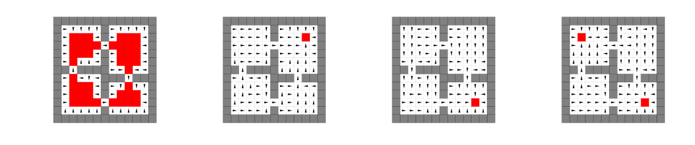

# options

### Unofficial Python3 version of "[A Laplacian Framework for Option Discovery in Reinforcement Learning](http://proceedings.mlr.press/v70/machado17a/machado17a.pdf)" paper.
----

Images from the paper:

  
  <em>Second PVF (left) and its corresponding option (right) in the 4-room domain. Action terminate is depicted in red (top right corner), other actions are depicted as arrows.</em>

  
  <em>Options obtained from the four smallest eigenvectors in the 4-room domain. Action terminate is depicted in red.</em>

Images obtained by running the official Python2 code:

  
  
  
  
  <em>Options obtained from the four smallest eigenvectors in the 4-room domain. Action terminate is depicted using dots.</em>

